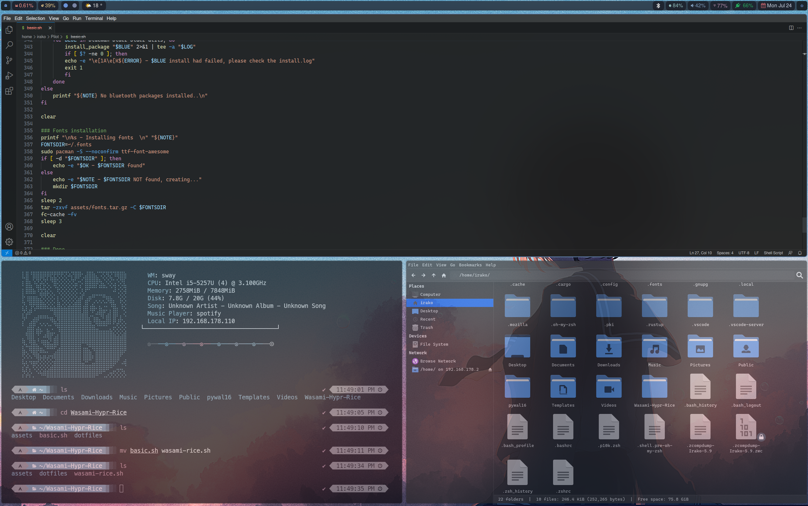
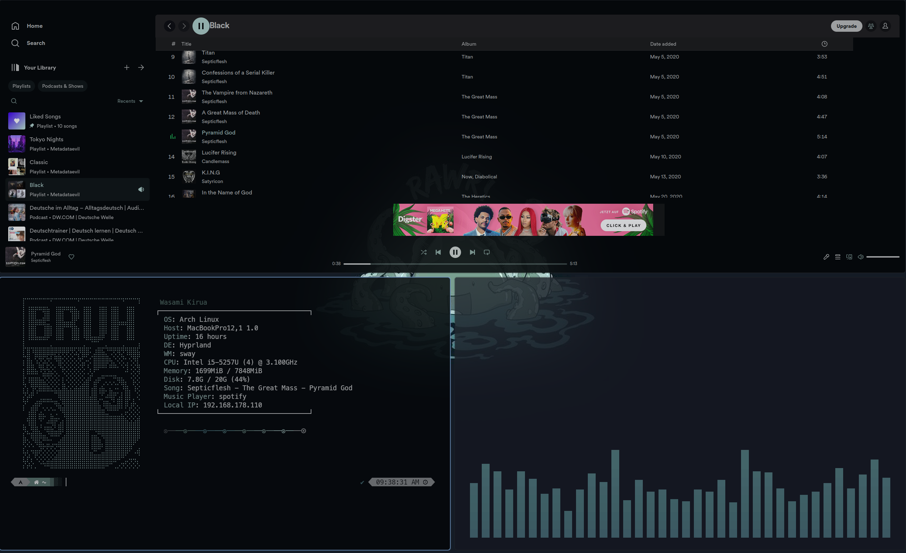
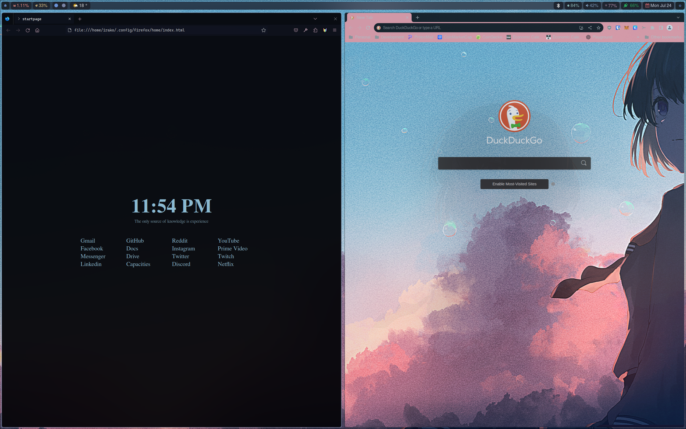

<div align="center">
    <h1>Kakikori Rice</h1>
</div>

<div align="center">






</div>

<div align="center">
    <h1>Installations :sweat_drops:</h1>
</div>

## Some features and configs

-   Select a wallpaper with `Super + W` the color palatte will change as well
-   Discord, Spotify, VS Code, and Firefox are also themed
-   Add your wallpapers in the $HOME/.config/hypr/wallpapers
-   Toggle full screen: `CTRL ALT + F`
-   Launcher: `Super + Space`
-   Power menu: `Super + X`
-   Lock Screen: `Super + L`
-   Terminal: `Super + Enter`
-   Ranger: `Super + Shift + Enter`
-   VS Code: `CTRL + Alt + C`
-   Discord: `Super + D`
-   Spotify: `Super + S`
-   Spotify with cava: `CTRL + Alt + S`
-   Telegram: `SUPER + T`
-   Waybar responds to mouse click or mouse over (Bluetooth, Wifi, Battery, Weather, Date/Time ecc)
-   And more ...

## First installation script

- A fresh installed Arch system: minimal profile, Pipewire, "git" only as additional package, the installation scripts will take care of the rest.

> **Note**
> You need to place the ttf fonts under assets/ some fonts will be installed via yay but others won't. if you do not want to brake the look after reboot you will need at least:  https://github.com/1amSimp1e/fonts/blob/master/CascadiaMono.zip

For additional fonts have a look at: [fonts](https://github.com/iamverysimp1e/fonts)

  ```zsh
  
  ./wasami-rice.sh

  ```

### Setting up Zsh Powerlevel10k and Oh My Zsh

Do these first before copying the `.zshrc` and `.p10k.zsh` files to your home directory:

-   Install first Oh My Zsh by running this command:
    ```
    sh -c "$(curl -fsSL https://raw.githubusercontent.com/ohmyzsh/ohmyzsh/master/tools/install.sh)"
    ```
-   Install the Powerlevel10k theme:
    ```
    git clone --depth=1 https://github.com/romkatv/powerlevel10k.git ${ZSH_CUSTOM:-$HOME/.oh-my-zsh/custom}/themes/powerlevel10k
    ```
-   Install the syntax highlighting plugin and the autosuggestions plugin:

    ```
    git clone https://github.com/zsh-users/zsh-syntax-highlighting.git ${ZSH_CUSTOM:-~/.oh-my-zsh/custom}/plugins/zsh-syntax-highlighting
    ```

    ```
    git clone https://github.com/zsh-users/zsh-autosuggestions ${ZSH_CUSTOM:-~/.oh-my-zsh/custom}/plugins/zsh-autosuggestions
    ```

After that, you can now copy the `.zshrc` and `.p10k.zsh` files to your home directory.

### Installing Pywal:

If you want the regular Pywal, you can install it with `paru -S python-pywal`. But if you want 16 colors to be generated (which I use in this), you can install it by:

-   Cloning [this](https://github.com/eylles/pywal16) repo
-   `cd` into the repo and run `pip3 install --user --break-system-packages .`

### Second installation script:

- I've slitted the tasks for an easier management and troubleshooting in case of issues. while the first script take care of the entire system preparation process, this script perform some replacement, copy the files under your HOME dir and start the bluetooth as well sddm  

```
cd dotfiles
./install.sh
```

Once done, you can reboot your system. you might encounter errors, if yes keep calm and try to understand what went wrong. Even if I've tested these scripts several time your system will be never identical to mine.

### Setting up Firefox

If you use Firefox and want to have Pywal colors:

-   Download the theme extension [here.](https://addons.mozilla.org/en-US/firefox/addon/pywalfox/)
-   Run `pywalfox update` in your terminal.

Once done, you don't need to worry about manually updating the colors everytime you change your wallpaper. A script already takes care of that BUT you do need to manually restart Firefox to apply the new colors.

The `userChrome.css` can be found in `.config/firefox/home/style.css`. the install.sh will replace for you my $USER with yours but you might want to double check that.

If you want to have the custom Firefox homepage, be sure to modify line 1 in `.config/firefox/home/style.css` (replace "uiriamu" with your Linux username). After that, set your home page in Firefox to a URL directing to the `index.html` file (e.g., file:///home/{yourusername}/.config/firefox/home/index.html)

### Setting up Spotify

-   Open and login with Spotify first.
-   Run these in your terminal:

    ```
    sudo chmod a+wr /opt/spotify
    sudo chmod a+wr /opt/spotify/Apps -R
    ```

-   Once done, initially run `spicetify backup apply` in your terminal.
-   Then you can set the theme by running `spicetify config current_theme Pywal` in your terminal to set the color theme.

Open Spotify and you should be good to go.

Note that you need to restart Spotify everytime the colors are changed. This process will be automatically done if you run Spotify using the `CTRL + Alt + S` keybind that I've set in `hyprland.conf` (you can change this keybind to whatever you want).


### Setting up Discord
Login with Discord first, then run `betterdiscordctl install` in your terminal, that will install Better Discord.

There's a short and easy-to-follow guide for setting up Discord with Pywal [here](https://github.com/FilipLitwora/pywal-discord).

### Notes

I am completely new to ricing, one saturday morning while i was looking at UnixPorn for my first time, I've 
decided to dig deeper. My skills helped me definetely out to make the process shorter but honestly I've ancountered many problems. I hope this job can help every new joiner like me out. 

### Credits

this work would have never been possibile without the awesome jobs of these dudes:

- https://github.com/1amSimp1e/dots/tree/late-night-%F0%9F%8C%83
- https://github.com/rchrdwllm/dotfiles/tree/master
- https://github.com/JaKooLit/Hyprland-v3